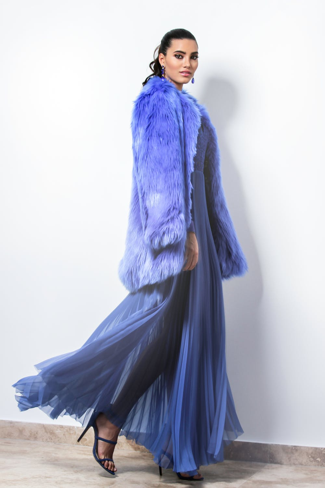
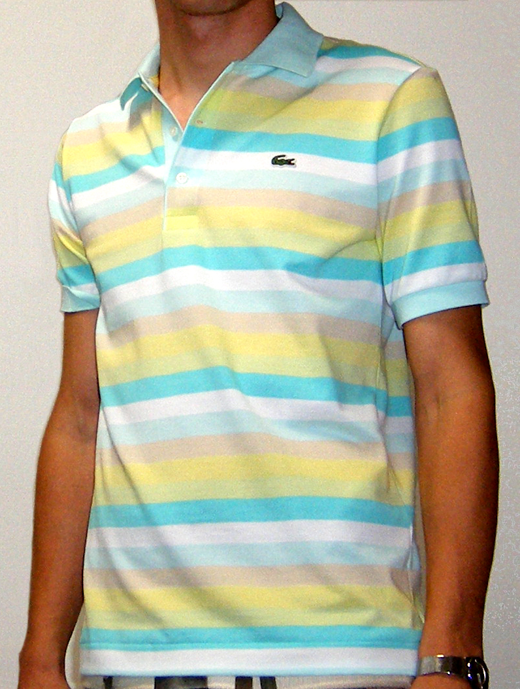

# FashionCLIP Image Classifier

This Demo provides a tool to classify images using the FashionCLIP model. It processes an image and classifies it based on predefined vocabulary sets. The results are the top classes (categories) that the image likely belongs to, based on the similarity scores computed by the CLIP model.

## Model and Vocabulary:
- Utilizes the pretrained CLIP model from `patrickjohncyh/fashion-clip`.
- Supports custom vocabulary sets for classification. We provide vocabulary for Parts/Types, Colours/Patterns, Brands and Fabrics.
- Allows users to specify the maximum number of words per category, the path to the vocabulary directory, and the number of top classes to be printed per category.

## Usage:
```bash
python clip_image_classifier.py -f <path_to_image> [-v <max_vocab>] [-d <vocab_directory>] [-n <number_of_top_classes>]
```

## Arguments:
- `-f, --file IMG`: Specify the path to the image file. (Required)
- `-v, --maxvocab`: Maximum number of words per category. Default is 600.
- `-d, --dir DIR`: Path to the vocabulary directory. Default is `vocab/`.
- `-n, --number`: Number of top classes to be printed per category. Default is 5.

## Sample Results:
| Image | Types / Parts | Colour / Patterns | Brands | Fabric |
|:---------------------------:|:-------:|:-------:|:-------:|:-----:|
| </img> | 0.305, Bouffant gown<br>0.252, Fur clothing<br>0.077, Mantle (royal garment)<br>0.058, Reconstructed clothing<br>0.039, Haute couture | 0.559,	 Blue-violet<br>0.111,	 Blue<br>0.071,	 Electric blue<br>0.062,	 Cobalt blue<br>0.055,	 Indigo | 0.371,	 Zara<br>0.222,	 Elie Saab<br>0.100,	 Net-a-Porter<br>0.042,	 ASOS<br>0.036,	 Furla | 0.687,	 Fur clothing<br>0.269,	 chiffon<br>0.022,	 velvet<br>0.011,	 Rayon<br>0.004,	 Silk<br> |
| </img>| 0.917,	 Polo shirt<br>0.024,	 Shirt<br>0.010,	 Henley shirt<br>0.008,	 Hem<br>0.006,	 Collar<br>| 0.472,	 Stripes<br>0.122,	 Retro<br>0.084,	 Tan<br>0.078,	 Designer<br>0.034,	 Lemon<br> | 0.750,	 Lacoste<br>0.050,	 ASOS<br>0.028,	 Nike<br>0.028,	 Tommy Hilfiger<br>0.024,	 Patagonia<br> | 0.760,	 Silk<br>0.073,	 velvet<br>0.060,	 Cotton<br>0.021,	 Linen<br>0.021,	 chiffon<br> |

Image sources for the examples:

Ricardo Acevedo: https://www.pexels.com/de-de/foto/frau-die-blauen-pelzmantel-und-kleid-tragt-1375736/

Wikimedia: https://commons.wikimedia.org/wiki/File:Tennis-shirt-lacoste.jpg
## Dependencies:
- `PIL` for image processing.
- `transformers` for utilizing the FashionCLIP model and processor.

## License
```
Copyright (C) 2023 by Jules Kreuer - @not_a_feature
This piece of software is published unter the GNU General Public License v3.0
TLDR:

| Permissions      | Conditions                   | Limitations |
| ---------------- | ---------------------------- | ----------- |
| ✓ Commercial use | Disclose source              | ✕ Liability |
| ✓ Distribution   | License and copyright notice | ✕ Warranty  |
| ✓ Modification   | Same license                 |             |
| ✓ Patent use     | State changes                |             |
| ✓ Private use    |                              |             |
```
Go to [LICENSE.md](https://github.com/not-a-feature/FashionClass/blob/main/LICENSE) to see the full version.